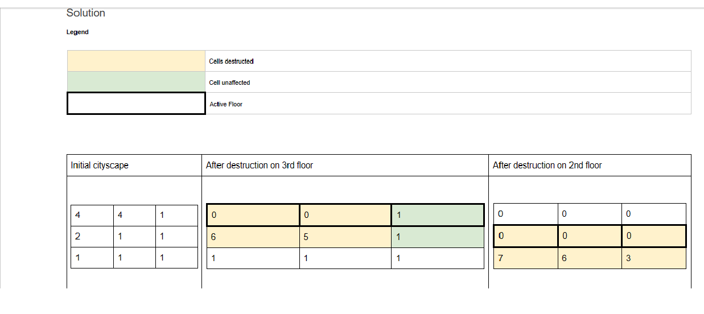
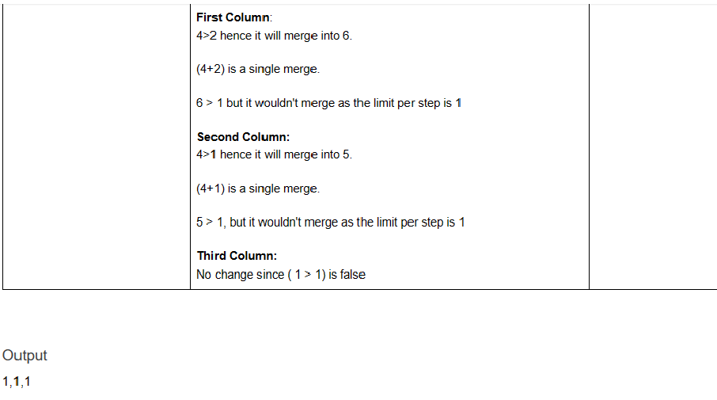
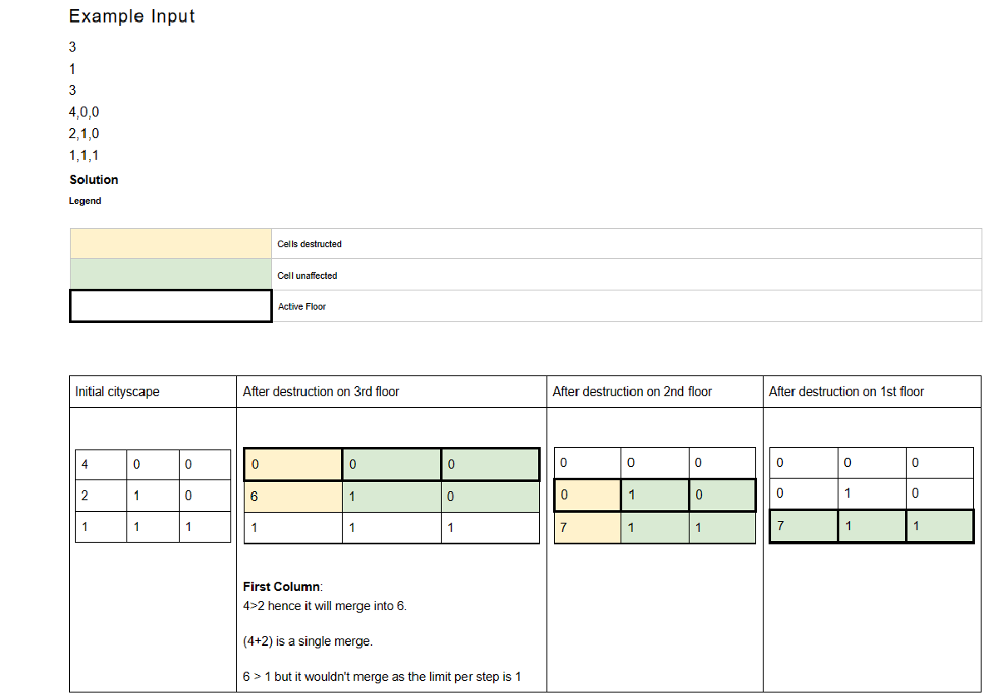
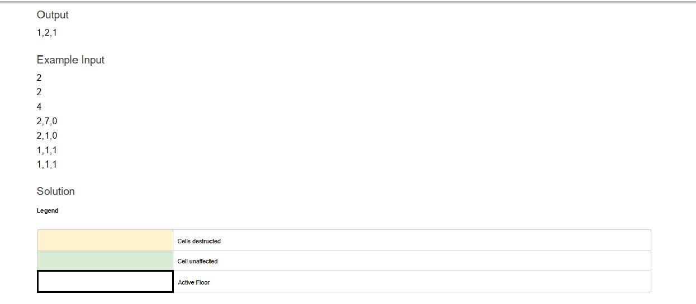
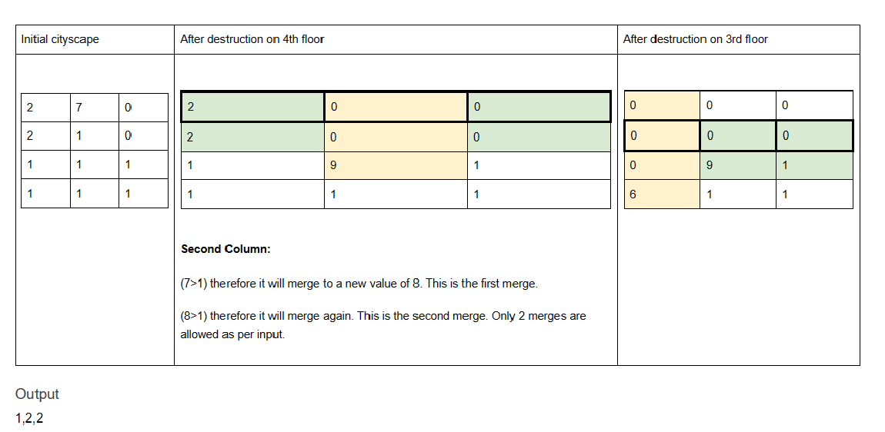

# MBS The Line

Mohammed bin Salman Al Saud (MBS) is the current crown Prince of Saudi Arabia. He is a visionary leader determined to reduce dependency of its regional economy on export of black gold(oil). He is planning to launch a new tourist attraction named "The Line". "Often referred to as a 'groundscraper,' the singular structure will stretch 170 kilometers over one hundred miles to house a city of nine million people. The project is reinventing urbanism, seeking to remove the pollution, noise, and sprawl of city living in favor of an ultra-efficient utopia. To put the scale of THE LINE into perspective, it would take over an hour perhaps nearly two hours to drive that length by car. The team at NEOM claims that with its system of high-speed transport, one could reach end-to-end in no more than twenty minutes. Tall and narrow, the city will be 500 meters above sea level and 200 meters wide. (1,640 feet high and 650 feet wide). That's taller still than the 102-story Empire State Building and its spire."

<b> You are working on designing a simulator to determine the damage in case of natural disaster.
You are provided the data of the cityscape in 2d array format. Each column (1) represents a building in a city. Each cell represents the weight (W) of a specific floor on that building. </b>

## Simulation Rules

- Your system will run the simulation X number of times (T(X), T(X-1)... T(1)). Simulation will start from the first row of input data.
- While running the simulation, floor (F) will merge with the floor below only if the total weight on all the floors above is greater than it.
- For any given building cell it will continue to merge until it reaches the limit of merges allowed (Y) per step. On each merge, the new weight of the cell will be the sum of floors involved in destruction.
- Single merge is defined as all the weights that get summed with respect to a single floor. (See example for further detail)

## Final Result

- Your system will output the height of each building after Xth step.

## Input

The input will be read from a file. The filename/path is passed to your program as the first command-line argument. The file will contain:

## Output

- Comma separated height of each building after running simulation for X steps
- Number of steps (X) to simulate.
- Allowed consecutive vertical merges (Y), for each step per building.
- Number of rows (R) to follow:
- 2D array of data (i.e 1st building has floors at weigh 1,2,4 for 1st, 2nd and 3rd floor respectively)

## Constraints

- 1 < X <= R
- 0<Y <= 10^5
- 1 < R <10^5
- 0 < W< 10^10

## Example Input

2  
1  
3  
4,4,1  
2,1,1  
1,1,1  

## Example Input

